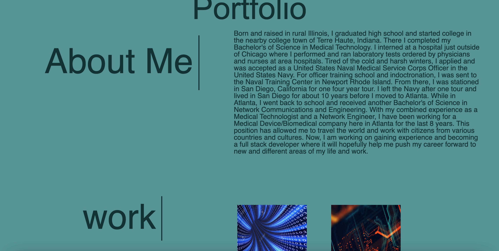

# Basic HTML & CSS profile page
    
## Table of Contents
* [Description](#description) 
* [Installation](#installation)
* [Usage](#usage)
* [Credits](#credits)
* [License](#license)
* [Badge](#badge)
* [Questions](#questions)
    
## Description
* Basic Profile page consisting of only HTML and CSS

    
## Installation
* no installation necessary.  Use modern web browser to access webpage.
    
## Usage
* no instructions required. Webpage can be accessed from any web browser.
    
## Credits
* N/A
    
## License
* Licensed by mit
    
## Badge
* 
    
## Questions
* For any questions, concerns, or additional help, please contact klucas72@hotmail.com.